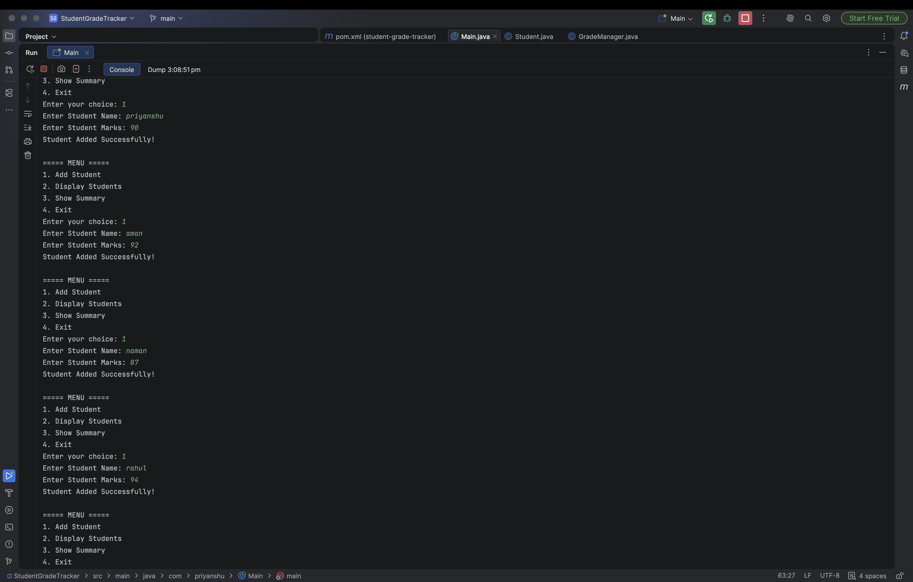

# Student Grade Tracker 🎓

A Java-based Student Grade Tracker application developed using Object-Oriented Programming concepts. This project helps manage student records, calculate marks, and generate grades efficiently.

## 🚀 Features

- Add student details
- Store student information
- Calculate average marks
- Assign grades based on performance
- Display student records
- Simple console-based user interface

## 🛠️ Technologies Used

- Java
- Maven
- Object-Oriented Programming (OOP)
- ArrayList Collection Framework

## 📂 Project Structure
## 📸 Project Output

